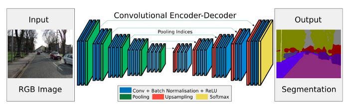

# Semantic-Segmentation-for-Self-driving-cars
Self-driving cars require a deep understanding of their surroundings. To support this, camera frames are used to recognize the road, pedestrians, cars, and sidewalks at a pixel-level accuracy. In this project, we develop a neural network and optimize it to perform semantic segmentation using Unet and Segnets.
Semantic segmentation is the task of assigning meaning of part of an object. this can be done at the pixel level where we assign each pixel to a target class such as road, car, pedestrian, sign or any number of other classes.

## Implementation in this Project

### Overall Architecture
#### Segnet

Some applications include autonomous driving, scene understanding, etc. Direct adoption of classification networks for pixel wise segmentation yields poor results mainly because max-pooling and subsampling reduce feature map resolution and hence output resolution is reduced. Even if extrapolated to original resolution, lossy image is generated.

# DataSet 
https://www.kaggle.com/dansbecker/cityscapes-image-pairs
